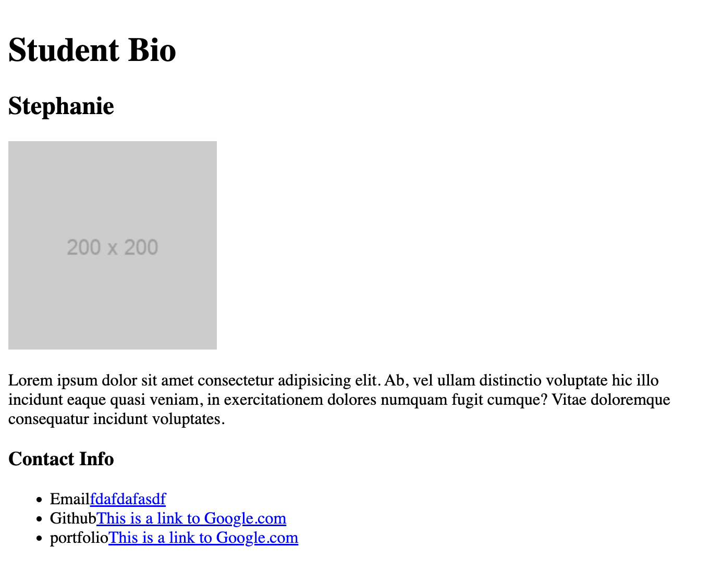

# basichtmlpage

## Creating a basic HTML page

The webpage includes placeholders for the image and contact information that would be a basic portfolio setup

## Updating the basic HTML page by adding simple attributes to help visualize classes and id's

The webpage now includes attributes that helps user's visualize classes and Id's. The blue area is separated with a class attribute that will be used on all elements using the tag section</break>However the elements email, github, and portfolio were given Id's to help separate and give each element its own unique attribute.

